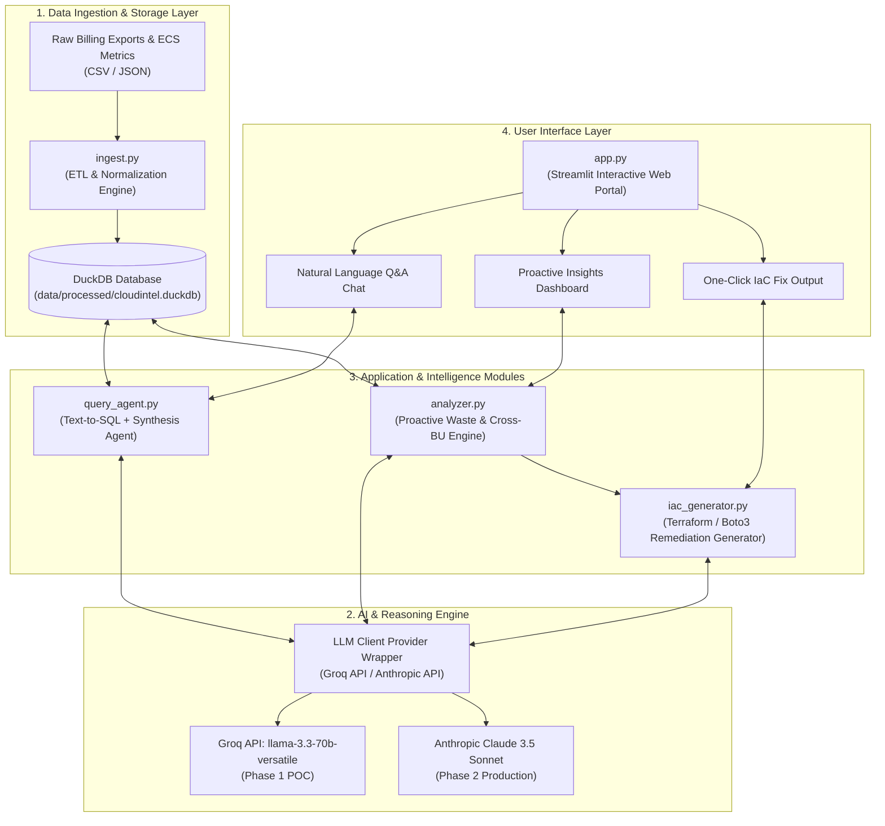
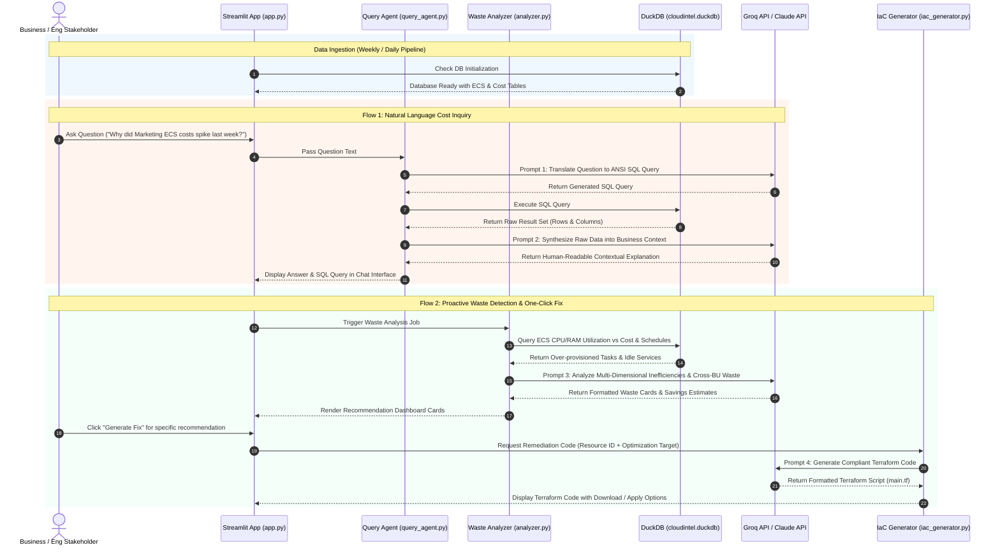

# CloudIntel — Enterprise AI FinOps Platform
## System Architecture Specification

---

## 1. Executive Summary & Vision

**CloudIntel** is an enterprise-grade AI FinOps intelligence platform designed to eliminate cloud waste across decentralized Business Units (BUs). Traditional cloud management tools produce complex JSON logs and static charts that business stakeholders struggle to interpret. Furthermore, cost optimization knowledge acquired in one BU rarely propagates to others.

CloudIntel bridges this gap by combining an analytical data pipeline, Large Language Model (LLM) reasoning, and automated Infrastructure as Code (IaC) generation. Stakeholders interact with their cloud infrastructure via plain English, receive contextual explanations of cost drivers, view proactive waste recommendations, and generate one-click Terraform remediation code.

---

## 2. Two-Phase Architecture Strategy

To enable rapid validation, immediate stakeholder alignment, and zero-cost prototyping before procuring enterprise licenses, CloudIntel uses a **Two-Phase Architecture Strategy**:

| Component | Phase 1: Proof of Concept (POC) — Free Open Tools | Phase 2: Enterprise Production Scale |
| :--- | :--- | :--- |
| **Primary Cloud Resource** | **Amazon ECS** (Fargate & EC2 container task/cluster metrics) | **All AWS Resources** (EC2, S3, RDS, Lambda, DynamoDB, Network) |
| **AI / LLM Model Engine** | **Groq Cloud API** (`llama-3.3-70b-versatile`) — *100% Free API* | **Anthropic Claude 3.5 Sonnet** — *Enterprise License* |
| **Database & Analytical Engine** | **DuckDB** (Free in-process OLAP analytical database) | **AWS Athena / Amazon Redshift / Snowflake** |
| **Storage & Data Lake** | Local Directory (`data/raw/`, `data/processed/`) | AWS S3 Bucket + AWS Glue Data Catalog |
| **User Interface (UI)** | **Streamlit Application** (Local / Streamlit Community Cloud) | Enterprise Web Portal (Streamlit / Next.js on AWS App Runner) |
| **Remediation Target** | Local Terraform CLI / Boto3 Dry-Run Scripts | AWS CI/CD Pipeline (Terraform Cloud / AWS CodePipeline) |

---

## 3. High-Level Architecture Diagram



---

## 4. End-to-End System Sequence & Data Flow



---

## 5. Detailed Component Specifications

### 5.1 Module 1: Data Pipeline (`ingest.py`)
- **Purpose**: Ingests raw Cost & Usage Reports (CUR) and CloudWatch ECS metrics, standardizes formats, and populates the local analytical database.
- **Inputs**:
  - `data/raw/aws_cur_export.csv` — Billing line items (Unblended Cost, Usage Amount, Resource ID, Tags).
  - `data/raw/ecs_task_metrics.json` — Container task metrics (vCPU allocated, Memory allocated, Max CPU %, Max Memory %).
- **Operations**:
  1. Parses raw CSV and JSON files using `pandas`.
  2. Normalizes resource metadata into standardized columns.
  3. Computes daily resource metrics and links cost data with performance metrics using `resource_id`.
  4. Writes aggregated tables into `data/processed/cloudintel.duckdb`.

### 5.2 Module 2: Natural Language Query Agent (`query_agent.py`)
- **Purpose**: Translates plain-English user questions into valid DuckDB SQL queries and converts query outputs into natural language explanations.
- **Two-Stage Prompt Pipeline**:
  - **Stage 1 (Text-to-SQL)**: Passes database schema context + user question to LLM. Returns clean SQL query.
  - **Stage 2 (Context Synthesis)**: Takes SQL query results + original question. Prompts LLM to explain *why* costs changed, highlighting business units, spikes, and drivers.

### 5.3 Module 3: Proactive Waste Analyzer (`analyzer.py`)
- **Purpose**: Autonomously scans DuckDB tables to flag cost waste patterns without requiring user prompts.
- **Target Waste Categories (Focus: ECS POC)**:
  - **Over-provisioned ECS Tasks**: Tasks with high allocated CPU/RAM (e.g. 8 vCPU / 16 GB) but peak usage < 10%.
  - **Idle ECS Services**: Staging/dev container services running 24/7 outside business hours (9 AM - 5 PM).
  - **Cross-BU Optimization Sharing**: Identifies architectural waste in BU 'B' that matches resolved patterns from BU 'A'.

### 5.4 Module 4: Infrastructure as Code Generator (`iac_generator.py`)
- **Purpose**: Converts identified waste recommendations into production-ready, compliant Terraform code.
- **Output Artifacts**:
  - `main.tf` — Terraform configuration (e.g. updated `aws_ecs_task_definition` resource limits, `aws_appautoscaling_policy`).
  - `variables.tf` — Parameterized variables for CPU/Memory and service counts.

### 5.5 Module 5: User Interface (`app.py`)
- **Framework**: Streamlit web application.
- **Layout**:
  - **Sidebar**: LLM status (Groq API connected), Database status (DuckDB loaded), Business Unit filter.
  - **Tab 1: Chat Assistant**: Interactive Natural Language Q&A with text-to-SQL visibility.
  - **Tab 2: Proactive Savings Dashboard**: Recommendation cards sorted by estimated monthly savings ($).
  - **Tab 3: Remediation & IaC Studio**: Interactive Terraform code viewer with copy/download buttons.

---

## 6. Database Schema Specification (DuckDB)

### 6.1 Table: `raw_cost_reports`
| Column Name | Data Type | Description |
| :--- | :--- | :--- |
| `line_item_id` | `VARCHAR` | Primary key / Unique transaction ID |
| `usage_start_date` | `TIMESTAMP` | Start timestamp of usage |
| `resource_id` | `VARCHAR` | AWS Resource ARN or ID (e.g., `arn:aws:ecs:...`) |
| `resource_type` | `VARCHAR` | AWS Service classification (`ECS-Fargate`, `ECS-EC2`, `EC2`, `S3`) |
| `business_unit` | `VARCHAR` | Business Unit Tag (`Marketing`, `Engineering`, `DataScience`) |
| `daily_cost` | `DOUBLE` | Unblended cost in USD |
| `usage_amount` | `DOUBLE` | Quantity of usage (e.g., vCPU-hours, GB-hours) |

### 6.2 Table: `ecs_task_metrics`
| Column Name | Data Type | Description |
| :--- | :--- | :--- |
| `task_arn` | `VARCHAR` | ECS Task ARN |
| `cluster_name` | `VARCHAR` | ECS Cluster Name |
| `service_name` | `VARCHAR` | ECS Service Name |
| `business_unit` | `VARCHAR` | Associated Business Unit |
| `cpu_reserved` | `INTEGER` | Reserved CPU units (e.g., 1024, 2048, 4096) |
| `memory_reserved` | `INTEGER` | Reserved Memory in MiB (e.g., 2048, 8192) |
| `cpu_utilization_max` | `DOUBLE` | Peak CPU utilization % recorded |
| `memory_utilization_max` | `DOUBLE` | Peak Memory utilization % recorded |
| `launch_type` | `VARCHAR` | Launch type (`FARGATE` or `EC2`) |
| `is_business_hours_only` | `BOOLEAN` | Whether work is intended for business hours only |

---

## 7. Repository Directory Structure

```plaintext
cloudintel/
├── data/
│   ├── raw/                      # Raw billing CSVs and ECS metrics JSON
│   │   ├── aws_cur_export.csv
│   │   └── ecs_task_metrics.json
│   └── processed/                # Cleaned analytical database
│       └── cloudintel.duckdb
├── docs/                         # Documentation artifacts
│   ├── PROBLEM_STATEMENT.md      # Problem statement & milestone scope
│   └── ARCHITECTURE.md           # System architecture specification
├── ingest.py                     # Week 1: ETL & DuckDB ingestion engine
├── query_agent.py                # Week 2: Text-to-SQL & synthesis agent
├── analyzer.py                   # Week 3: Proactive ECS waste analyzer
├── iac_generator.py              # Week 4: Terraform remediation generator
├── app.py                        # Week 4: Streamlit web UI application
├── requirements.txt              # Dependencies (duckdb, groq, streamlit, pandas)
└── README.md                     # Project overview & quickstart guide
```

---

## 8. Security, Environment, and Deployment Guidelines

1. **API Keys & Secrets Management**:
   - Store API keys strictly in `.env` or environment variables (`GROQ_API_KEY` for Phase 1 POC; `ANTHROPIC_API_KEY` for Phase 2).
   - `.env` must be listed in `.gitignore` to prevent credential exposure.
2. **Data Privacy & Anonymization**:
   - All sample cloud billing data and metric logs in `data/raw/` must use mock account IDs and anonymized resource ARNs.
3. **Execution Commands**:
   - Run ETL: `python ingest.py`
   - Run Waste Analyzer: `python analyzer.py`
   - Launch Streamlit App: `streamlit run app.py`
