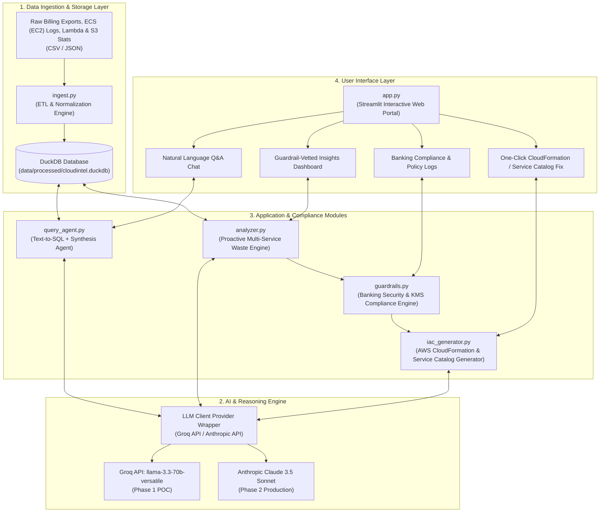
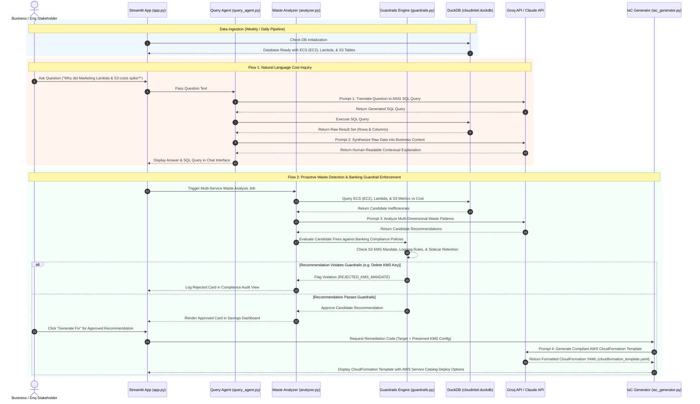

# CloudIntel — Enterprise AI FinOps Platform
## System Architecture Specification

---

## 1. Executive Summary & Vision

**CloudIntel** is an enterprise-grade AI FinOps intelligence platform designed to eliminate cloud waste across decentralized Business Units (BUs). Traditional cloud management tools produce complex JSON logs and static charts that business stakeholders struggle to interpret. Furthermore, cost optimization knowledge acquired in one BU rarely propagates to others.

In a banking environment, AI-driven cost optimization must operate under strict security, data protection, and enterprise compliance standards, adhering strictly to bank provisioning workflows. Optimization tools often make dangerous suggestions—such as deleting AWS Managed KMS keys or turning off encryption to cut costs. Furthermore, infrastructure changes in our bank are strictly governed by **AWS Service Catalog** using compliant **AWS CloudFormation** templates. CloudIntel bridges this gap by combining an analytical data pipeline, Large Language Model (LLM) reasoning, automated AWS CloudFormation template generation (integrated with AWS Service Catalog), and an active **Banking Security & Compliance Guardrails Engine**. Stakeholders interact with their cloud infrastructure via plain English, receive contextual cost explanations, view compliance-vetted waste recommendations, and generate one-click AWS CloudFormation remediation code.

---

## 2. Two-Phase Architecture Strategy

To enable rapid validation, immediate stakeholder alignment, and zero-cost prototyping before procuring enterprise licenses, CloudIntel uses a **Two-Phase Architecture Strategy**:

| Component | Phase 1: Proof of Concept (POC) — Multi-Service Scope | Phase 2: Enterprise Production Scale |
| :--- | :--- | :--- |
| **Primary Cloud Resources** | **Amazon ECS** (EC2 launch type), **AWS Lambda**, **Amazon S3** | **All AWS Resources** (EC2, S3, RDS, Lambda, DynamoDB, Network) |
| **AI / LLM Model Engine** | **Groq Cloud API** (`llama-3.3-70b-versatile`) — *100% Free API* | **Anthropic Claude 3.5 Sonnet** — *Enterprise License* |
| **Compliance Layer** | **Banking Guardrails Engine** (Enforces KMS encryption, security policies) | Enterprise Policy Engine (AWS OPA / Sentinel / AWS Config) |
| **Database & Analytical Engine** | **DuckDB** (Free in-process OLAP analytical database / S3 `httpfs`) | **AWS Athena / Amazon Redshift / Snowflake** |
| **Storage & Data Lake** | Local Directory (`data/raw/`, `data/processed/`) or AWS S3 Bucket | AWS S3 Bucket + AWS Glue Data Catalog |
| **User Interface (UI)** | **Streamlit Application** (Local / Streamlit Community Cloud) | Enterprise Web Portal (Streamlit / Next.js on AWS App Runner) |
| **Remediation Target** | **AWS CloudFormation (YAML/JSON)** & AWS Service Catalog Product Templates | AWS CI/CD Pipeline (AWS Service Catalog Portfolio / CodePipeline) |

---

## 3. High-Level Architecture Diagram



---

## 4. End-to-End System Sequence & Data Flow



---

## 5. Detailed Component Specifications

### 5.1 Module 1: Data Pipeline (`ingest.py`)
- **Purpose**: Ingests raw Cost & Usage Reports (CUR), CloudWatch ECS container metrics (EC2 launch type), AWS Lambda invocation/duration metrics, and S3 storage class/KMS statistics, standardizing formats into DuckDB.
- **Inputs**:
  - `data/raw/aws_cur_export.csv` — Billing line items (Unblended Cost, Usage Amount, Resource ID, Tags).
  - `data/raw/ecs_task_metrics.json` — ECS container task metrics (EC2 launch type, CPU/Memory reserved vs peak used).
  - `data/raw/lambda_metrics.json` — Serverless execution metrics (Memory allocated, Max memory used, Execution duration, Invocations).
  - `data/raw/s3_storage_metrics.json` — Object storage stats (Standard/Glacier storage bytes, KMS key ARN, Encryption flag, Object age).
- **Operations**:
  1. Parses raw CSV and JSON files using `pandas`.
  2. Normalizes resource metadata into standardized columns.
  3. Computes daily resource metrics and links cost data with performance metrics using `resource_id`.
  4. Writes aggregated tables into `data/processed/cloudintel.duckdb`.

### 5.2 Module 2: Natural Language Query Agent (`query_agent.py`)
- **Purpose**: Translates plain-English user questions into valid DuckDB SQL queries across ECS, Lambda, and S3 tables, converting query outputs into natural language explanations.
- **Two-Stage Prompt Pipeline**:
  - **Stage 1 (Text-to-SQL)**: Passes database schema context + user question to LLM. Returns clean SQL query.
  - **Stage 2 (Context Synthesis)**: Takes SQL query results + original question. Prompts LLM to explain *why* costs changed, highlighting business units, spikes, and drivers.

### 5.3 Module 3: Proactive Waste Analyzer (`analyzer.py`)
- **Purpose**: Autonomously scans DuckDB tables across ECS (EC2), Lambda, and S3 to flag cost waste patterns without requiring user prompts.
- **Target Waste Categories**:
  - **ECS (EC2) Tasks**: Over-provisioned container task definitions (e.g. 8 vCPU / 16 GB allocated, peak usage < 10%).
  - **AWS Lambda**: Over-provisioned memory allocation (e.g. 3072 MB configured, actual max memory 128 MB) and unused provisioned concurrency.
  - **S3 Storage**: Old log files or inactive objects residing in S3 Standard storage suitable for Glacier/IA lifecycle policies.
  - **Cross-BU Optimization Sharing**: Identifies architectural waste in BU 'B' matching resolved patterns from BU 'A'.

### 5.4 Module 4: Banking Security & Compliance Guardrails Engine (`guardrails.py`)
- **Purpose**: Acts as an enterprise policy interceptor that validates every candidate recommendation before it reaches the UI or CloudFormation generator.
- **Banking Compliance Rules**:
  1. **S3 KMS Key Encryption Mandate (`RULE_S3_KMS`)**:
     - Explicitly blocks any recommendation that attempts to delete, detach, or downgrade AWS Managed KMS keys (`aws_kms_key` / SSE-KMS) to cut API costs.
  2. **ECS Security Sidecar Retention (`RULE_ECS_SIDECARS`)**:
     - Ensures container task definition resizing preserves mandatory security monitoring and telemetry sidecars in `AWS::ECS::TaskDefinition`.
  3. **Lambda Telemetry & Minimum Memory (`RULE_LAMBDA_BOUNDS`)**:
     - Enforces lower bounds on Lambda memory reductions to guarantee security wrapper execution and prevents disabling AWS X-Ray / CloudWatch telemetry.
  4. **Zero Public Access & Service Catalog Governance (`RULE_NO_PUBLIC_ACCESS`)**:
     - Mandates that S3 lifecycle changes explicitly retain `PublicAccessBlockConfiguration` with `BlockPublicAcls: true` and `BlockPublicPolicy: true`.

### 5.5 Module 5: Infrastructure as Code Generator (`iac_generator.py`)
- **Purpose**: Converts approved, guardrail-vetted recommendations into production-ready, compliant **AWS CloudFormation templates** compatible with **AWS Service Catalog** products.
- **Output Artifacts**:
  - `cloudformation_template.yaml` — Guardrail-checked AWS CloudFormation template (e.g., updated `AWS::ECS::TaskDefinition` container limits, `AWS::Lambda::Function` memory, `AWS::S3::Bucket` lifecycle rules preserving `BucketEncryption` with `ServerSideEncryptionRule` using KMS).
  - `service_catalog_product.json` — AWS Service Catalog Product artifact configuration and parameter mappings.

### 5.6 Module 6: User Interface (`app.py`)
- **Framework**: Streamlit web application.
- **Layout**:
  - **Sidebar**: LLM status (Groq API connected), Database status (DuckDB loaded), Business Unit filter, Banking Guardrails Mode toggle (Active/Audit).
  - **Tab 1: Chat Assistant**: Interactive Natural Language Q&A with text-to-SQL visibility across ECS, Lambda, and S3.
  - **Tab 2: Proactive Savings Dashboard**: Recommendation cards sorted by estimated monthly savings ($) displaying Banking Compliance Pass badges.
  - **Tab 3: Compliance & Guardrail Audit Log**: Transparent view of rejected unsafe recommendations (e.g., "KMS Key Removal Blocked").
  - **Tab 4: Remediation & CloudFormation Studio**: Interactive AWS CloudFormation YAML code viewer with copy/download options and AWS Service Catalog product links.

---

## 6. Database Schema Specification (DuckDB)

### 6.1 Table: `raw_cost_reports`
| Column Name | Data Type | Description |
| :--- | :--- | :--- |
| `line_item_id` | `VARCHAR` | Primary key / Unique transaction ID |
| `usage_start_date` | `TIMESTAMP` | Start timestamp of usage |
| `resource_id` | `VARCHAR` | AWS Resource ARN or ID |
| `resource_type` | `VARCHAR` | Service type (`ECS-EC2`, `AWS-Lambda`, `S3-Standard`, `S3-Glacier`, `AWS-KMS`) |
| `business_unit` | `VARCHAR` | Business Unit Tag (`Marketing`, `Engineering`, `DataScience`) |
| `daily_cost` | `DOUBLE` | Unblended cost in USD |
| `usage_amount` | `DOUBLE` | Quantity of usage (e.g., vCPU-hours, GB-hours, Invocations) |

### 6.2 Table: `ecs_task_metrics`
| Column Name | Data Type | Description |
| :--- | :--- | :--- |
| `task_arn` | `VARCHAR` | ECS Task ARN |
| `cluster_name` | `VARCHAR` | ECS Cluster Name |
| `service_name` | `VARCHAR` | ECS Service Name |
| `business_unit` | `VARCHAR` | Associated Business Unit |
| `cpu_reserved` | `INTEGER` | Reserved CPU units (e.g., 1024, 2048, 4096) |
| `memory_reserved` | `INTEGER` | Reserved Memory in MiB (e.g., 2048, 8192) |
| `cpu_utilization_max` | `DOUBLE` | Peak CPU utilization % recorded |
| `memory_utilization_max` | `DOUBLE` | Peak Memory utilization % recorded |
| `launch_type` | `VARCHAR` | Launch type (`EC2`) |
| `has_security_sidecar` | `BOOLEAN` | Whether container task includes mandatory security sidecar |

### 6.3 Table: `lambda_metrics`
| Column Name | Data Type | Description |
| :--- | :--- | :--- |
| `function_arn` | `VARCHAR` | Lambda Function ARN |
| `function_name` | `VARCHAR` | Lambda Function Name |
| `business_unit` | `VARCHAR` | Associated Business Unit |
| `memory_allocated_mb` | `INTEGER` | Configured memory size in MB |
| `memory_max_used_mb` | `INTEGER` | Peak recorded memory usage in MB |
| `avg_duration_ms` | `DOUBLE` | Average execution duration in milliseconds |
| `invocations_count` | `INTEGER` | Number of function invocations in window |
| `timeout_seconds` | `INTEGER` | Configured execution timeout |

### 6.4 Table: `s3_storage_metrics`
| Column Name | Data Type | Description |
| :--- | :--- | :--- |
| `bucket_name` | `VARCHAR` | S3 Bucket Name |
| `business_unit` | `VARCHAR` | Associated Business Unit |
| `kms_key_arn` | `VARCHAR` | AWS Managed KMS Key ARN for bucket encryption |
| `is_kms_encrypted` | `BOOLEAN` | True if SSE-KMS encryption is active |
| `storage_bytes_standard` | `BIGINT` | Bytes stored in S3 Standard class |
| `storage_bytes_glacier` | `BIGINT` | Bytes stored in S3 Glacier/IA class |
| `object_count` | `BIGINT` | Total object count |
| `has_lifecycle_policy` | `BOOLEAN` | True if S3 lifecycle transition rule exists |

### 6.5 Table: `candidate_recommendations`
| Column Name | Data Type | Description |
| :--- | :--- | :--- |
| `recommendation_id` | `VARCHAR` | Unique ID for waste recommendation |
| `resource_id` | `VARCHAR` | Target AWS Resource ARN |
| `service_type` | `VARCHAR` | `ECS-EC2`, `AWS-Lambda`, `S3` |
| `estimated_monthly_savings` | `DOUBLE` | Estimated cost reduction ($) |
| `proposed_fix_description` | `VARCHAR` | Summary of proposed optimization |
| `compliance_status` | `VARCHAR` | `APPROVED` or `REJECTED_KMS_MANDATE` / `REJECTED_SECURITY_POLICY` |
| `guardrail_rule_triggered` | `VARCHAR` | Specific policy rule ID evaluated |

---

## 7. Repository Directory Structure

```plaintext
cloudintel/
├── data/
│   ├── raw/                      # Raw billing CSVs, ECS (EC2) logs, Lambda & S3 stats
│   │   ├── aws_cur_export.csv
│   │   ├── ecs_task_metrics.json
│   │   ├── lambda_metrics.json
│   │   └── s3_storage_metrics.json
│   └── processed/                # Cleaned analytical database
│       └── cloudintel.duckdb
├── docs/                         # Documentation artifacts
│   ├── PROBLEM_STATEMENT.md      # Problem statement & milestone scope
│   └── ARCHITECTURE.md           # System architecture specification
├── ingest.py                     # Week 1: Multi-service ETL & DuckDB ingestion engine
├── query_agent.py                # Week 2: Text-to-SQL & synthesis agent
├── analyzer.py                   # Week 3: Proactive multi-service waste analyzer
├── guardrails.py                 # Week 3: Banking Security & Compliance Policy Engine
├── iac_generator.py              # Week 4: Compliant CloudFormation & Service Catalog remediation generator
├── app.py                        # Week 4: Streamlit web UI application
├── requirements.txt              # Dependencies (duckdb, groq, streamlit, pandas)
└── README.md                     # Project overview & quickstart guide
```

---

## 8. Security, Environment, and Deployment Guidelines

1. **API Keys & Secrets Management**:
   - Store API keys strictly in `.env` or environment variables (`GROQ_API_KEY` for Phase 1 POC; `ANTHROPIC_API_KEY` for Phase 2).
   - `.env` must be listed in `.gitignore` to prevent credential exposure.
2. **Data Privacy & Anonymization**:
   - All sample cloud billing data and metric logs in `data/raw/` must use mock account IDs and anonymized resource ARNs.
3. **Execution Commands**:
   - Run ETL: `python ingest.py`
   - Run Guardrail Waste Analyzer: `python analyzer.py`
   - Launch Streamlit App: `streamlit run app.py`
