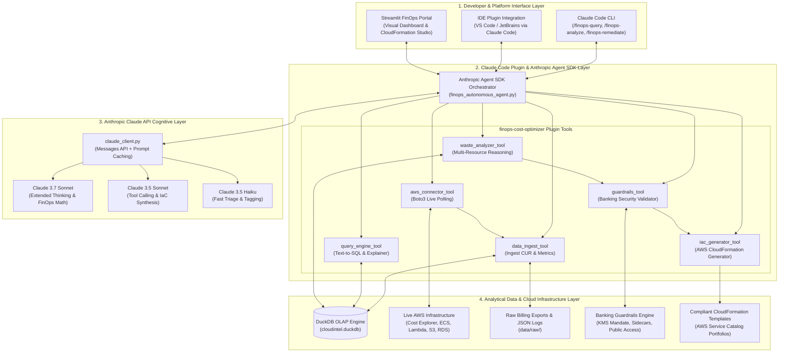
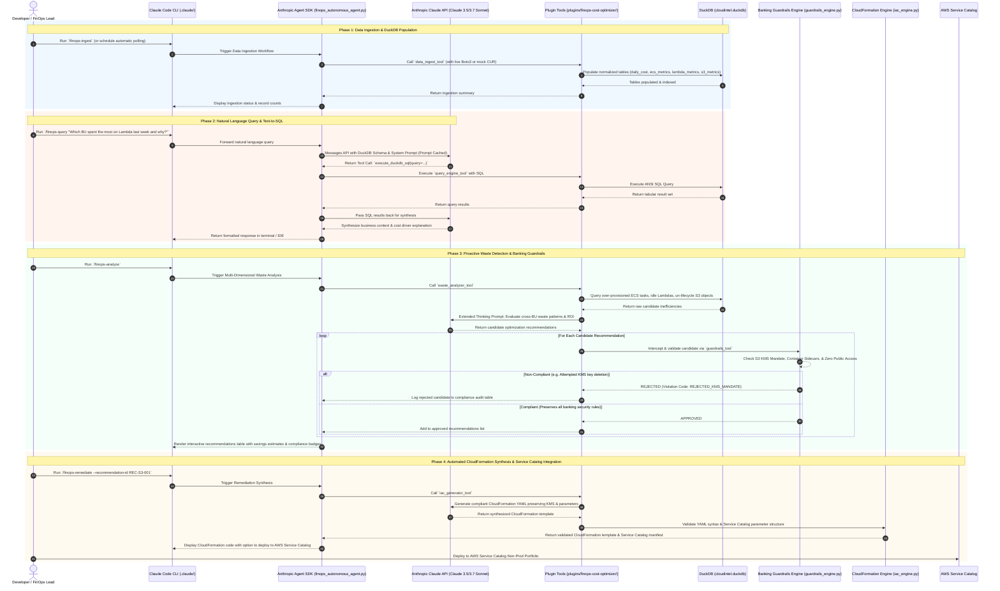
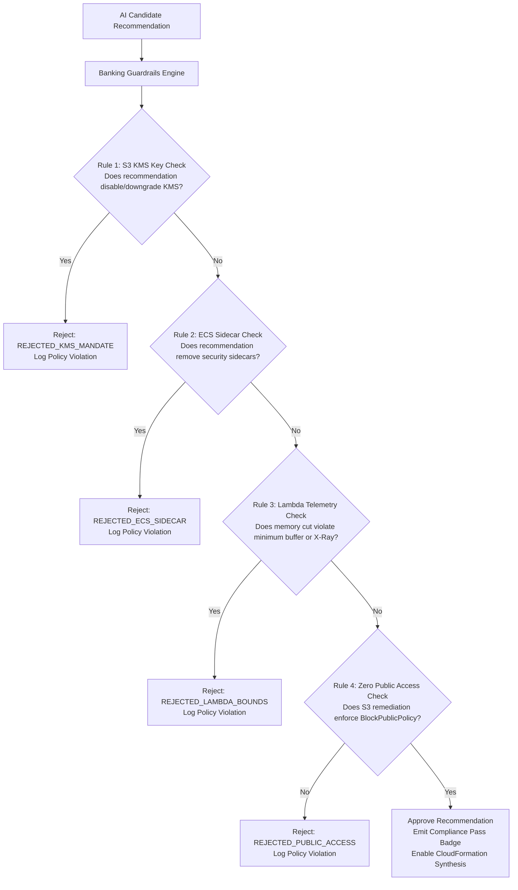

# CloudIntel — Enterprise AI FinOps Platform & Claude Code Plugin Ecosystem
## System Architecture Specification

---

## 1. Executive Summary & Vision

**CloudIntel** is an enterprise-grade AI FinOps intelligence platform engineered to eliminate cloud waste across decentralized Business Units (BUs) in strict compliance with banking and financial sector standards.

Traditional cloud management tools produce complex JSON logs, obscure cost graphs, and disconnected dashboards that fail to provide actionable clarity to engineering and business stakeholders. Furthermore, in banking environments, cost optimization is severely constrained: AI recommendations must **never** weaken security (e.g., removing AWS KMS encryption, dropping container monitoring sidecars, or opening public access), and all infrastructure provisioning is strictly governed by **AWS Service Catalog** using compliant **AWS CloudFormation** templates.

To bring proactive FinOps intelligence directly into developer workflows, **CloudIntel is powered natively by the Anthropic Claude API (Claude 3.5 Sonnet / Claude 3.7 Sonnet) and architected as an integrated Claude Code Plugin and Anthropic Agent SDK ecosystem (`claude-code-plugins`)**.

Stakeholders interact with their cloud infrastructure through natural language inside **Claude Code CLI**, IDEs, and automated CI/CD pipelines. The AI agent autonomously ingests multi-account telemetry and billing data into an in-process DuckDB OLAP engine, executes multi-dimensional waste reasoning, enforces rigorous **Banking Security & Compliance Guardrails**, and auto-generates compliant **AWS CloudFormation** templates formatted for enterprise **AWS Service Catalog** deployment.

---

## 2. Technology & Architectural Strategy Matrix

| Component | Specification / Technology | Purpose in Platform |
| :--- | :--- | :--- |
| **Primary AI Engine** | **Anthropic Claude API (`claude-3-7-sonnet-20250219` / `claude-3-5-sonnet-20241022`)** | Deep FinOps reasoning, accurate Text-to-SQL generation, native tool calling, and high-fidelity CloudFormation template authoring. |
| **High-Throughput Triage** | **Anthropic Claude 3.5 Haiku (`claude-3-5-haiku-20241022`)** | Rapid billing record classification, log normalization, and real-time cost anomaly triage. |
| **Agent Orchestration** | **Anthropic Agent SDK (`anthropic`)** | Multi-turn autonomous reasoning, tool calling, scratchpad memory, and structured Pydantic outputs. |
| **Developer Interface** | **Claude Code Plugin & Slash Commands** | Direct integration into Claude Code CLI & IDE (`/finops-query`, `/finops-analyze`, `/finops-remediate`). |
| **Prompt Optimization** | **Anthropic Prompt Caching (`cache_control`)** | Caching database schemas, banking compliance rules, and AWS pricing models for 90% API cost reduction. |
| **Analytical Database** | **DuckDB (In-Process Columnar OLAP)** | High-performance analytical SQL queries over raw billing exports and CloudWatch metric logs without external database infrastructure costs. |
| **Cloud Target** | **Amazon Web Services (AWS)** | Ingestion and remediation across ECS (EC2 launch type), Lambda, S3, RDS, DynamoDB, and VPC Networking. |
| **AWS Authentication** | **AWS IAM Role Federation / Boto3** | System account federation across multi-account enterprise registries (`accounts.json` / AWS Organizations). |
| **Compliance Layer** | **Banking Guardrails Engine** | Programmatic verification blocking unsafe AI recommendations (Mandatory KMS, sidecar retention, zero public access). |
| **IaC Remediation** | **AWS CloudFormation & AWS Service Catalog** | Generates standardized, enterprise-compliant YAML/JSON CloudFormation templates ready for Service Catalog portfolios. |
| **Containerization** | **VS Code Dev Containers (`.devcontainer`)** | Reproducible development environment with pre-installed Claude CLI, AWS CLI, DuckDB, and security sandboxes. |
| **CI/CD Automation** | **GitLab CI/CD (`.gitlab/`)** | Automated linting, pytest suites, banking compliance verification, and CloudFormation security audits. |

---

## 3. High-Level Architecture Diagram



---

## 4. End-to-End System Sequence & Data Flow



---

## 5. Repository Architecture & Component Breakdown

```plaintext
claude-code-plugins/
├── .claude-plugin/                        # Plugin manifest & marketplace configuration
│   ├── manifest.json                      # Plugin metadata, tool definitions, skills, hooks
│   └── plugin-config.yaml                 # FinOps plugin lifecycle & runtime config
│
├── .claude/                               # Claude Code workspace settings & prompt definitions
│   ├── settings.json                      # Workspace permissions, tool access rules, model presets
│   ├── commands/                          # Custom slash commands for Claude Code CLI
│   │   ├── finops-query.md                # /finops-query — Natural language Text-to-SQL FinOps Q&A
│   │   ├── finops-analyze.md              # /finops-analyze — Multi-dimensional waste detection
│   │   ├── finops-remediate.md            # /finops-remediate — CloudFormation template generation
│   │   ├── finops-guardrails.md           # /finops-guardrails — Compliance audit & policy logs
│   │   └── finops-ingest.md               # /finops-ingest — Live AWS / mock CUR data ingestion
│   └── rules/                             # Behavioral rules and banking compliance constraints
│       └── finops-compliance-rules.md     # Mandatory KMS, sidecar retention, zero public access
│
├── .devcontainer/                         # Containerized development environment
│   ├── devcontainer.json                  # VS Code / Codespaces dev container specification
│   ├── Dockerfile                         # Python 3.11+, AWS CLI v2, DuckDB, Claude Code CLI tools
│   └── scripts/
│       └── setup-permissions.sh           # Custom credential handlers & sandbox security policies
│
├── .gitlab/                               # GitLab CI/CD pipelines & automated integrations
│   ├── ci/
│   │   ├── lint-and-test.gitlab-ci.yml    # Pytest, Black, Flake8, MyPy type checks
│   │   ├── guardrail-audit.gitlab-ci.yml  # Automated banking security compliance test suite
│   │   └── iac-validate.gitlab-ci.yml     # cfn-lint and cfn-nag CloudFormation security validation
│   └── integrations/
│       └── drawio-export.sh               # Drawio plugin integrations for auto-generating architecture SVGs
│
├── agent-sdk-example/                     # Anthropic Agent SDK reference implementations & evaluations
│   ├── finops_autonomous_agent.py        # Multi-turn autonomous FinOps agent using Anthropic Claude API
│   ├── custom_tools.py                    # Anthropic Agent SDK tool wrappers (DuckDB, Boto3, Guardrails)
│   ├── evaluation/                        # Evaluation benchmarks & scoring framework
│   │   ├── eval_benchmarks.json           # 50+ golden benchmark queries & expected SQL/cost insights
│   │   ├── evaluate_accuracy.py           # Text-to-SQL precision & hallucination evaluation runner
│   │   └── benchmark_results.md           # Accuracy, latency, and guardrail compliance reports
│   └── README.md                          # Guide for running & extending the Agent SDK examples
│
├── docs/                                  # Project & plugin documentation
│   ├── PROBLEM_STATEMENT.md               # Vision, problem definition, and acceptance criteria
│   ├── ARCHITECTURE.md                    # This document (System architecture specification)
│   ├── DEVELOPER_GUIDE.md                 # Local setup and plugin development guide
│   ├── PLUGIN_INSTALLATION_GUIDE.md       # Plugin installation & Claude Code configuration guide
│   ├── BANKING_GUARDRAILS_SPEC.md         # Detailed banking security policies & rule IDs
│   ├── SERVICE_CATALOG_INTEGRATION.md     # AWS Service Catalog portfolio deployment manual
│   ├── USER_GUIDE.md                      # End-user operational guide
│   ├── deployment-plan.md                 # Deployment & environment promotion plan
│   └── Implementation-plan.md             # Phased engineering implementation plan
│
├── plugins/                               # Core plugin modules
│   └── finops-cost-optimizer/             # FinOps Cost Optimizer Claude Code Plugin
│       ├── __init__.py
│       ├── manifest.json                  # Plugin-specific capability declarations
│       ├── tools/                         # Modular tool implementations (invoked by Claude / Agent SDK)
│       │   ├── __init__.py
│       │   ├── data_ingest_tool.py        # Ingests CUR, ECS, Lambda, S3, RDS metrics into DuckDB
│       │   ├── query_engine_tool.py       # Text-to-SQL translation & DuckDB query execution via Claude API
│       │   ├── waste_analyzer_tool.py     # Multi-resource pattern recognition & waste scoring
│       │   ├── guardrails_tool.py         # Banking compliance filter (KMS, sidecars, security)
│       │   ├── iac_generator_tool.py      # Compliant AWS CloudFormation & Service Catalog generator
│       │   └── aws_connector_tool.py      # Boto3 live AWS Cost Explorer & CloudWatch connector
│       ├── core/                          # Underlying business logic engines
│       │   ├── __init__.py
│       │   ├── claude_client.py           # Native Anthropic Claude API wrapper with caching & retry logic
│       │   ├── ingest_engine.py           # ETL normalization & DuckDB schema management
│       │   ├── analyzer_engine.py         # 7 major waste category analytical algorithms
│       │   ├── guardrails_engine.py       # Policy-driven compliance validation logic
│       │   └── iac_engine.py              # CloudFormation YAML/JSON AST & template builder
│       ├── skills/                        # Claude Code skill instructions
│       │   └── finops-analysis/
│       │       └── SKILL.md               # Cheatsheet & prompt instructions for FinOps workflows
│       └── accounts.json                  # Enterprise AWS account registry & BU mappings
│
├── tests/                                 # Automated test suites
│   ├── __init__.py
│   ├── conftest.py                        # Pytest fixtures, mock DuckDB, and mock Claude API responses
│   ├── unit/                              # Unit tests for core engines
│   │   ├── test_claude_client.py          # Tests Anthropic API connectivity, caching, and message handling
│   │   ├── test_ingest.py                 # Tests CSV/JSON ingestion, schema normalization
│   │   ├── test_query_agent.py            # Tests Text-to-SQL generation and context explainer
│   │   ├── test_analyzer.py               # Tests ECS, Lambda, S3, RDS waste detection logic
│   │   ├── test_guardrails.py             # Tests KMS mandate, sidecar protection, public access blocks
│   │   └── test_iac_generator.py          # Tests CloudFormation synthesis & syntax validity
│   ├── integration/                       # Integration & tool-calling tests
│   │   ├── test_claude_tools.py           # Tests Claude Code plugin tool bindings
│   │   ├── test_agent_sdk_workflow.py     # Tests end-to-end multi-turn Agent SDK execution
│   │   └── test_aws_connector.py          # Tests live/mock Boto3 multi-account polling
│   └── security/                          # Security & compliance regression tests
│       └── test_banking_compliance.py     # Rejection tests for unsafe AI cost-saving proposals
│
├── .env.example                           # Template for environment variables (ANTHROPIC_API_KEY, AWS configs)
├── .gitignore                             # Git ignore rules (data files, duckdb, caches, secrets)
├── requirements.txt                       # Python dependencies (anthropic, duckdb, boto3, pydantic, etc.)
└── README.md                              # Root project overview, quickstart, and plugin showcase
```

---

## 6. Detailed Module Specifications

### 6.1 `claude_client.py` (Anthropic Claude API Wrapper)
- **Purpose**: Provides a resilient, type-safe interface to the Anthropic Messages API (`anthropic` SDK) with built-in **Prompt Caching** and exponential backoff retry handling.
- **Key Features**:
  - Automatically wraps system prompts, database schemas, and banking guardrail rules in `cache_control: {"type": "ephemeral"}` blocks.
  - Dynamically routes complex multi-BU reasoning and mathematical calculations to `claude-3-7-sonnet-20250219` with Extended Thinking enabled, and high-throughput tagging to `claude-3-5-haiku-20241022`.
  - Handles JSON Schema validation for all Claude tool calls.

### 6.2 `plugins/finops-cost-optimizer/tools/`
1. **`data_ingest_tool.py`**:
   - Executes ETL pipeline from CSV/JSON billing data or live Boto3 polling into normalized DuckDB tables.
2. **`query_engine_tool.py`**:
   - Accepts plain-English questions, sends cached DuckDB schema to Claude, executes returned SQL, and synthesizes contextual explanations.
3. **`waste_analyzer_tool.py`**:
   - Executes multi-dimensional SQL scans over DuckDB and applies Claude reasoning across compute (ECS/EC2), serverless (Lambda), storage (S3), and database (RDS) resources.
4. **`guardrails_tool.py`**:
   - Evaluates optimization proposals against banking compliance rules (`RULE_S3_KMS`, `RULE_ECS_SIDECARS`, `RULE_LAMBDA_BOUNDS`, `RULE_NO_PUBLIC_ACCESS`).
5. **`iac_generator_tool.py`**:
   - Leverages Claude 3.5/3.7 Sonnet code generation to author valid, formatted AWS CloudFormation templates ready for AWS Service Catalog portfolio integration.
6. **`aws_connector_tool.py`**:
   - Interfaces with AWS Cost Explorer, CloudWatch, ECS, Lambda, and S3 APIs using federated IAM execution roles.

### 6.3 `agent-sdk-example/` (Anthropic Agent SDK Framework)
- **`finops_autonomous_agent.py`**:
  - Implements an autonomous multi-turn FinOps agent using the Anthropic Agent SDK.
  - Maintains an iterative scratchpad/thought chain: `Plan -> Select Tool -> Execute Tool -> Evaluate Result -> Verify Guardrails -> Final Response`.
- **`evaluation/`**:
  - Golden benchmark dataset (`eval_benchmarks.json`) containing 50+ enterprise FinOps scenarios with ground-truth SQL and cost savings.
  - Automated evaluation script (`evaluate_accuracy.py`) measuring Text-to-SQL exact match, execution accuracy, guardrail interception rate, and latency.

---

## 7. Database Schema Specification (DuckDB)

### 7.1 Table: `daily_cost_summary`
| Column Name | Data Type | Description |
| :--- | :--- | :--- |
| `line_item_id` | `VARCHAR` | Primary key / Unique billing record ID |
| `account_id` | `VARCHAR` | AWS Account ID (12-digit) |
| `usage_start_date` | `TIMESTAMP` | Start timestamp of usage |
| `resource_id` | `VARCHAR` | AWS Resource ARN or Resource ID |
| `resource_type` | `VARCHAR` | Service type (`ECS-EC2`, `AWS-Lambda`, `S3`, `RDS`, `DynamoDB`, `VPC-NAT`) |
| `business_unit` | `VARCHAR` | Business Unit Tag (`Marketing`, `Engineering`, `DataScience`) |
| `daily_cost` | `DOUBLE` | Unblended cost in USD |
| `usage_amount` | `DOUBLE` | Usage quantity (vCPU-hours, GB-hours, Invocations) |

### 7.2 Table: `ecs_container_metrics`
| Column Name | Data Type | Description |
| :--- | :--- | :--- |
| `task_arn` | `VARCHAR` | ECS Task ARN |
| `cluster_name` | `VARCHAR` | ECS Cluster Name |
| `service_name` | `VARCHAR` | ECS Service Name |
| `account_id` | `VARCHAR` | AWS Account ID |
| `business_unit` | `VARCHAR` | Associated Business Unit |
| `cpu_reserved` | `INTEGER` | Reserved CPU units (1024 = 1 vCPU) |
| `memory_reserved` | `INTEGER` | Reserved Memory in MiB |
| `cpu_utilization_p95` | `DOUBLE` | 95th percentile peak CPU utilization % |
| `memory_utilization_p95` | `DOUBLE` | 95th percentile peak Memory utilization % |
| `launch_type` | `VARCHAR` | Launch type (`EC2`) |
| `has_security_sidecar` | `BOOLEAN` | True if mandatory security sidecar is attached |

### 7.3 Table: `lambda_function_metrics`
| Column Name | Data Type | Description |
| :--- | :--- | :--- |
| `function_arn` | `VARCHAR` | Lambda Function ARN |
| `function_name` | `VARCHAR` | Lambda Function Name |
| `account_id` | `VARCHAR` | AWS Account ID |
| `business_unit` | `VARCHAR` | Associated Business Unit |
| `memory_allocated_mb` | `INTEGER` | Configured memory size in MB |
| `memory_max_used_mb` | `INTEGER` | Peak recorded memory usage in MB |
| `avg_duration_ms` | `DOUBLE` | Average execution duration in ms |
| `invocations_count` | `INTEGER` | Total invocations in measurement period |
| `provisioned_concurrency` | `INTEGER` | Configured provisioned concurrency |
| `timeout_seconds` | `INTEGER` | Configured execution timeout in seconds |

### 7.4 Table: `s3_bucket_metrics`
| Column Name | Data Type | Description |
| :--- | :--- | :--- |
| `bucket_name` | `VARCHAR` | S3 Bucket Name |
| `account_id` | `VARCHAR` | AWS Account ID |
| `business_unit` | `VARCHAR` | Associated Business Unit |
| `kms_key_arn` | `VARCHAR` | AWS Managed / Customer KMS Key ARN |
| `is_kms_encrypted` | `BOOLEAN` | True if SSE-KMS encryption is active |
| `storage_bytes_standard` | `BIGINT` | Bytes stored in S3 Standard class |
| `storage_bytes_glacier` | `BIGINT` | Bytes stored in S3 Glacier/IA class |
| `object_count` | `BIGINT` | Total object count in bucket |
| `has_lifecycle_policy` | `BOOLEAN` | True if lifecycle transition rules exist |
| `public_access_blocked` | `BOOLEAN` | True if all 4 public access block settings are active |

### 7.5 Table: `candidate_recommendations`
| Column Name | Data Type | Description |
| :--- | :--- | :--- |
| `recommendation_id` | `VARCHAR` | Unique ID for waste recommendation |
| `account_id` | `VARCHAR` | AWS Account ID |
| `resource_id` | `VARCHAR` | Target AWS Resource ARN |
| `service_type` | `VARCHAR` | Service category (`ECS-EC2`, `Lambda`, `S3`, `RDS`) |
| `estimated_monthly_savings` | `DOUBLE` | Estimated cost reduction ($ USD / month) |
| `proposed_fix_description` | `VARCHAR` | Summary of proposed optimization |
| `compliance_status` | `VARCHAR` | `APPROVED` or `REJECTED_KMS_MANDATE` / `REJECTED_SECURITY_POLICY` |
| `guardrail_rule_triggered` | `VARCHAR` | Specific policy rule ID evaluated |

---

## 8. Enterprise Banking Compliance & Security Specification



### Policy Rules Specification:
1. **`RULE_S3_KMS`**:
   - **Mandate**: S3 lifecycle and storage tiering optimizations must retain `BucketEncryption` with `ServerSideEncryptionRule` using AWS KMS (`aws_kms_key`).
   - **Violation Action**: Intercept and reject with violation code `REJECTED_KMS_MANDATE`.
2. **`RULE_ECS_SIDECARS`**:
   - **Mandate**: Container task resizing must preserve all security monitoring, audit logging, and intrusion detection container definitions in `AWS::ECS::TaskDefinition`.
   - **Violation Action**: Intercept and reject with violation code `REJECTED_ECS_SIDECAR`.
3. **`RULE_LAMBDA_BOUNDS`**:
   - **Mandate**: Memory optimization must maintain minimum memory thresholds required for enterprise tracing layers (AWS X-Ray / banking telemetry) and prevent execution timeouts.
   - **Violation Action**: Intercept and reject with violation code `REJECTED_LAMBDA_BOUNDS`.
4. **`RULE_NO_PUBLIC_ACCESS`**:
   - **Mandate**: S3 bucket modifications must explicitly enforce `PublicAccessBlockConfiguration` with `BlockPublicAcls: true`, `IgnorePublicAcls: true`, `BlockPublicPolicy: true`, and `RestrictPublicBuckets: true`.
   - **Violation Action**: Intercept and reject with violation code `REJECTED_PUBLIC_ACCESS`.

---

## 9. Security, Secrets Management, and Data Privacy

1. **Anthropic API Privacy & Zero-Retention**:
   - Direct integration via official `anthropic` SDK adheres to enterprise data privacy agreements ensuring customer cloud financial telemetry is never used for foundation model training.
2. **Secrets & Credentials Management**:
   - `ANTHROPIC_API_KEY`, `AWS_ACCESS_KEY_ID`, and session tokens are strictly loaded from environment variables (`.env`) or AWS Secrets Manager.
   - `.env` is permanently excluded via `.gitignore`.
3. **Data Masking & Account Isolation**:
   - In multi-tenant enterprise environments, account IDs and resource ARNs are validated against `accounts.json` registry to enforce role-based access control.

---

*CloudIntel System Architecture Specification — Standardized on Claude Code Plugin & Anthropic Agent SDK.*
