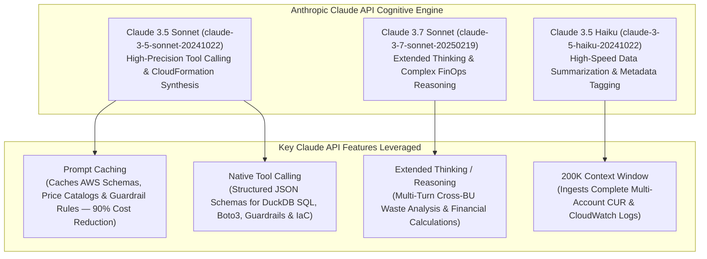
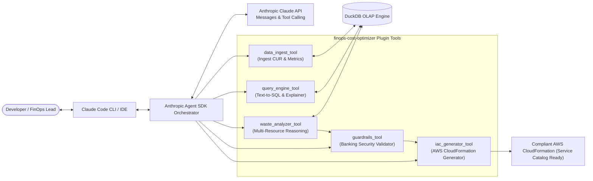

# Project: CloudIntel — Enterprise AI FinOps Platform & Claude Code Plugin Architecture

---

## 1. Executive Summary & Vision

**CloudIntel** is an enterprise-grade AI FinOps intelligence platform engineered to eliminate cloud waste across decentralized Business Units (BUs) in strict compliance with banking and financial sector standards.

As modern enterprises scale on AWS, decentralized cloud consumption leads to 20–35% untracked spend across compute (Amazon ECS on EC2, EC2 instances), serverless (AWS Lambda), storage (Amazon S3), databases (RDS, DynamoDB), and networking. Traditional cloud management tools produce dense JSON logs, obscure cost graphs, and disconnected dashboards that fail to give business and engineering leaders instant, actionable clarity. Furthermore, cost optimization knowledge acquired in one BU rarely propagates across the enterprise.

To eliminate context-switching and bring proactive FinOps intelligence directly into developer and platform engineering workflows, **CloudIntel is powered natively by the Anthropic Claude API (Claude 3.5 Sonnet / Claude 3.7 Sonnet) and architected as an integrated Claude Code Plugin and Anthropic Agent SDK ecosystem (`claude-code-plugins`)**.

This platform allows developers, DevOps engineers, and FinOps analysts to interact with their cloud infrastructure through natural language inside **Claude Code CLI**, their IDE, and automated CI/CD pipelines. The AI agent autonomously ingests multi-account telemetry and billing data into an in-process DuckDB OLAP engine, executes multi-dimensional waste reasoning, enforces rigorous **Banking Security & Compliance Guardrails** (such as mandatory AWS KMS encryption and container sidecar protection), and auto-generates compliant **AWS CloudFormation** templates formatted for enterprise **AWS Service Catalog** deployment.

---

## 2. The Big Problem

### 2.1 Enterprise FinOps Challenges
1. **Decentralized Spend & Multi-BU Silos**: Multiple BUs operate independent AWS accounts without standardized cost governance, causing duplicate idle resources and missed bulk-tiering benefits.
2. **Context-Switching & Tool Fatigue**: Engineers must navigate between AWS Cost Explorer, CloudWatch, S3 Console, terminal CLI, and SQL databases just to investigate a cost spike.
3. **Reactive vs. Proactive Optimization**: Engineering teams only notice cost overruns weeks after monthly billing invoices arrive, rather than catching resource waste in real-time.

### 2.2 Strict Banking Security & Compliance Constraints
In financial institutions and regulated banking environments, AI-driven cost optimization must **never** degrade security, compliance, or disaster recovery posture. Conventional optimization tools often propose hazardous recommendations—such as stripping AWS KMS keys, disabling bucket access logs, or dropping container monitoring sidecars to save money.

Furthermore, infrastructure provisioning in banking enterprises is strictly regulated:
- **No Ad-Hoc Scripts**: Manual or unmanaged infrastructure changes are forbidden.
- **AWS Service Catalog Governance**: All infrastructure changes must be deployed via vetted **AWS CloudFormation** product templates through central Service Catalog portfolios.
- **Non-Degradable Security Rules**: Mandatory AWS KMS encryption (`SSE-KMS`), zero public S3 bucket policies (`BlockPublicAcls`, `BlockPublicPolicy`), and telemetry sidecars must be preserved at all times.

### 2.3 The Solution: Native Claude API & Claude Code Plugin Architecture
Standalone web dashboards and generic LLM wrappers are isolated from where engineering work actually happens. By standardizing on the **Anthropic Claude API** and architecting CloudIntel as a **Claude Code Plugin** with the **Anthropic Agent SDK**, the platform delivers:
- **State-of-the-Art Reasoning & Coding**: Claude 3.5/3.7 Sonnet provides industry-leading SQL generation, multi-step financial mathematical analysis, and high-fidelity CloudFormation template authoring.
- **In-Workflow Execution**: Native slash commands (e.g., `/finops-analyze`, `/finops-query`, `/finops-remediate`, `/finops-guardrails`, `/finops-ingest`) in the developer's terminal and IDE via Claude Code CLI.
- **Autonomous Multi-Turn Agent Workflows**: The Anthropic Agent SDK autonomously plans queries, invokes specialized tools (DuckDB SQL, AWS Boto3 Connector, Guardrails Engine, CloudFormation Generator), self-evaluates candidate solutions, and verifies banking compliance.
- **Standardized Enterprise Plugin Structure**: A clean, scalable repository layout supporting modular plugins, containerized development (`.devcontainer`), automated CI/CD (`.gitlab`), and rigorous evaluation benchmarks (`agent-sdk-example`).

---

## 3. Anthropic Claude API Integration & Model Strategy

CloudIntel uses the official **Anthropic Claude Messages API** (`anthropic` Python SDK) as the core cognitive engine across all FinOps modules:



### 3.1 Model Selection & Allocation Matrix

| Model Tier | Anthropic Model ID | Platform Role & Workload Allocation |
| :--- | :--- | :--- |
| **Primary Reasoning & IaC Engine** | `claude-3-7-sonnet-20250219` / `claude-3-5-sonnet-20241022` | **Deep FinOps Reasoning & IaC Generation**: Complex Text-to-SQL translation, multi-BU waste pattern detection, extended thinking for cross-account mathematical ROI modeling, and compliant AWS CloudFormation template generation. |
| **High-Throughput / Fast-Path Engine** | `claude-3-5-haiku-20241022` | **Telemetry Cleansing & Fast Triage**: Initial billing record classification, log normalization, natural language intent categorization, and automated cost anomaly alerts. |

### 3.2 Key Claude API Capabilities Leveraged in CloudIntel

1. **Native Tool Calling / Function Calling (`tools` parameter)**:
   - Claude API is provided with formal JSON Schema declarations for all FinOps tools (`execute_duckdb_sql`, `fetch_aws_cloudwatch_metrics`, `validate_banking_guardrails`, `generate_cloudformation_template`).
   - Claude autonomously decides which tool to call, inspects intermediate query results, refines queries if errors occur, and passes vetted parameters to subsequent tools.

2. **Prompt Caching (`cache_control`)**:
   - Enterprise AWS database schemas, AWS pricing tables, and banking compliance policies (e.g., KMS mandates, sidecar rules) remain constant across queries.
   - By applying `cache_control: {"type": "ephemeral"}` to system prompts and schema definitions, CloudIntel achieves **up to 90% cost reduction** and **80% latency reduction** on repetitive FinOps queries.

3. **Extended Thinking & Hybrid Reasoning**:
   - Claude 3.7 Sonnet's extended thinking capability allows the agent to reason through non-trivial multi-dimensional trade-offs (e.g., calculating the financial impact of migrating S3 Standard objects to Glacier Instant Retrieval vs. Glacier Deep Archive considering retrieval frequencies, minimum storage durations, and KMS API call overhead).

4. **200K Token Context Window**:
   - Ingests large multi-account billing snapshots, extensive CloudFormation template structures, and detailed CloudWatch metric timeseries directly in context without information loss or arbitrary chunking.

5. **Enterprise Security & Compliance Compliance**:
   - Direct integration with Anthropic API adheres to enterprise SOC 2 Type II, ISO 27001, and HIPAA compliance standards, ensuring cloud financial data is processed in secure, isolated environments with zero training on customer data.

---

## 4. Target Project Architecture & Hierarchy

The repository is structured as a production-grade Claude Code Plugin workspace (`claude-code-plugins`):

```plaintext
claude-code-plugins/
├── .claude-plugin/                        # Plugin manifest & marketplace configuration
│   ├── manifest.json                      # Plugin metadata, tool definitions, skills, hooks
│   └── plugin-config.yaml                 # DAF Engineer / FinOps plugin lifecycle & runtime config
│
├── .claude/                               # Claude Code workspace settings & prompt definitions
│   ├── settings.json                      # Workspace permissions, tool access rules, model presets
│   ├── commands/                          # Custom slash commands for Claude Code CLI
│   │   ├── finops-query.md                # /finops-query — Natural language Text-to-SQL FinOps Q&A
│   │   ├── finops-analyze.md              # /finops-analyze — Multi-dimensional waste detection
│   │   ├── finops-remediate.md            # /finops-remediate — CloudFormation template generation
│   │   ├── finops-guardrails.md           # /finops-guardrails — Compliance audit & policy logs
│   │   └── finops-ingest.md               # /finops-ingest — Live AWS / mock CUR data ingestion
│   └── rules/                             # Behavioral rules and banking compliance constraints
│       └── finops-compliance-rules.md     # Mandatory KMS, sidecar retention, zero public access
│
├── .devcontainer/                         # Containerized development environment
│   ├── devcontainer.json                  # VS Code / Codespaces dev container specification
│   ├── Dockerfile                         # Python 3.11+, AWS CLI v2, DuckDB, Claude Code CLI tools
│   └── scripts/
│       └── setup-permissions.sh           # Custom credential handlers & sandbox security policies
│
├── .gitlab/                               # GitLab CI/CD pipelines & automated integrations
│   ├── ci/
│   │   ├── lint-and-test.gitlab-ci.yml    # Pytest, Black, Flake8, MyPy type checks
│   │   ├── guardrail-audit.gitlab-ci.yml  # Automated banking security compliance test suite
│   │   └── iac-validate.gitlab-ci.yml     # cfn-lint and cfn-nag CloudFormation security validation
│   └── integrations/
│       └── drawio-export.sh               # Drawio plugin integrations for auto-generating architecture SVGs
│
├── agent-sdk-example/                     # Anthropic Agent SDK reference implementations & evaluations
│   ├── finops_autonomous_agent.py        # Multi-turn autonomous FinOps agent using Anthropic Claude API
│   ├── custom_tools.py                    # Anthropic Agent SDK tool wrappers (DuckDB, Boto3, Guardrails)
│   ├── evaluation/                        # Evaluation benchmarks & scoring framework
│   │   ├── eval_benchmarks.json           # 50+ golden benchmark queries & expected SQL/cost insights
│   │   ├── evaluate_accuracy.py           # Text-to-SQL precision & hallucination evaluation runner
│   │   └── benchmark_results.md           # Accuracy, latency, and guardrail compliance reports
│   └── README.md                          # Guide for running & extending the Agent SDK examples
│
├── docs/                                  # Project & plugin documentation
│   ├── PROBLEM_STATEMENT.md               # This document (Problem, vision, architecture, and roadmap)
│   ├── ARCHITECTURE.md                    # Deep-dive system architecture, sequence flows & data models
│   ├── DEVELOPER_GUIDE.md                 # Setup, local development, and plugin authoring guide
│   ├── PLUGIN_INSTALLATION_GUIDE.md       # Step-by-step guide for installing & using the Claude Plugin
│   ├── BANKING_GUARDRAILS_SPEC.md         # Detailed banking security rules & policy specifications
│   ├── SERVICE_CATALOG_INTEGRATION.md     # AWS Service Catalog portfolio & CloudFormation integration
│   ├── USER_GUIDE.md                      # End-user operational guide (CLI & UI workflows)
│   └── edge-case.md                       # Resiliency, rate-limiting, and error-handling strategies
│
├── plugins/                               # Core plugin modules
│   └── finops-cost-optimizer/             # FinOps Cost Optimizer Claude Code Plugin
│       ├── __init__.py
│       ├── manifest.json                  # Plugin-specific capability declarations
│       ├── tools/                         # Modular tool implementations (invoked by Claude / Agent SDK)
│       │   ├── __init__.py
│       │   ├── data_ingest_tool.py        # Ingests CUR, ECS, Lambda, S3, RDS metrics into DuckDB
│       │   ├── query_engine_tool.py       # Text-to-SQL translation & DuckDB query execution via Claude API
│       │   ├── waste_analyzer_tool.py     # Multi-resource pattern recognition & waste scoring
│       │   ├── guardrails_tool.py         # Banking compliance filter (KMS, sidecars, security)
│       │   ├── iac_generator_tool.py      # Compliant AWS CloudFormation & Service Catalog generator
│       │   └── aws_connector_tool.py      # Boto3 live AWS Cost Explorer & CloudWatch connector
│       ├── core/                          # Underlying business logic engines
│       │   ├── __init__.py
│       │   ├── claude_client.py           # Native Anthropic Claude API wrapper with caching & retry logic
│       │   ├── ingest_engine.py           # ETL normalization & DuckDB schema management
│       │   ├── analyzer_engine.py         # 7 major waste category analytical algorithms
│       │   ├── guardrails_engine.py       # Policy-driven compliance validation logic
│       │   └── iac_engine.py              # CloudFormation YAML/JSON AST & template builder
│       ├── skills/                        # Claude Code skill instructions
│       │   └── finops-analysis/
│       │       └── SKILL.md               # Cheatsheet & prompt instructions for FinOps workflows
│       └── accounts.json                  # Enterprise AWS account registry & BU mappings
│
├── tests/                                 # Automated test suites
│   ├── __init__.py
│   ├── conftest.py                        # Pytest fixtures, mock DuckDB, and mock Claude API responses
│   ├── unit/                              # Unit tests for core engines
│   │   ├── test_claude_client.py          # Tests Anthropic API connectivity, caching, and message handling
│   │   ├── test_ingest.py                 # Tests CSV/JSON ingestion, schema normalization
│   │   ├── test_query_agent.py            # Tests Text-to-SQL generation and context explainer
│   │   ├── test_analyzer.py               # Tests ECS, Lambda, S3, RDS waste detection logic
│   │   ├── test_guardrails.py             # Tests KMS mandate, sidecar protection, public access blocks
│   │   └── test_iac_generator.py          # Tests CloudFormation synthesis & syntax validity
│   ├── integration/                       # Integration & tool-calling tests
│   │   ├── test_claude_tools.py           # Tests Claude Code plugin tool bindings
│   │   ├── test_agent_sdk_workflow.py     # Tests end-to-end multi-turn Agent SDK execution
│   │   └── test_aws_connector.py          # Tests live/mock Boto3 multi-account polling
│   └── security/                          # Security & compliance regression tests
│       └── test_banking_compliance.py     # Rejection tests for unsafe AI cost-saving proposals
│
├── .env.example                           # Template for environment variables (ANTHROPIC_API_KEY, AWS configs)
├── .gitignore                             # Git ignore rules (data files, duckdb, caches, secrets)
├── requirements.txt                       # Python dependencies (anthropic, duckdb, boto3, pydantic, etc.)
└── README.md                              # Root project overview, quickstart, and plugin showcase
```

---

## 5. Tooling & Technology Strategy Matrix

| Component | Specification / Technology | Purpose in Platform |
| :--- | :--- | :--- |
| **Primary AI Engine** | **Anthropic Claude API (`claude-3-7-sonnet-20250219` / `claude-3-5-sonnet-20241022`)** | Advanced reasoning, accurate Text-to-SQL generation, reliable tool calling, and high-fidelity CloudFormation synthesis. |
| **Fast Triage / Tagging** | **Anthropic Claude 3.5 Haiku (`claude-3-5-haiku-20241022`)** | High-speed billing data triage, log classification, and metadata enrichment. |
| **Agent Orchestration** | **Anthropic Agent SDK (`anthropic`)** | Autonomous multi-turn reasoning, custom tool execution, scratchpad memory, and structured Pydantic outputs. |
| **Developer Interface** | **Claude Code Plugin & Slash Commands** | Direct integration into Claude Code CLI & IDE (`/finops-query`, `/finops-analyze`, `/finops-remediate`). |
| **Prompt Optimization** | **Anthropic Prompt Caching** | Caching database schemas, banking compliance rules, and AWS pricing models for 90% API cost reduction. |
| **Analytical Database** | **DuckDB (In-Process Columnar OLAP)** | Ultra-fast analytical SQL queries over raw billing exports and CloudWatch metric logs without external database infrastructure costs. |
| **Cloud Target** | **Amazon Web Services (AWS)** | Ingestion and remediation across ECS (EC2 launch type), Lambda, S3, RDS, DynamoDB, and VPC Networking. |
| **AWS Authentication** | **AWS IAM Role Federation / Boto3** | System account federation across multi-account enterprise registries (`accounts.json` / AWS Organizations). |
| **Compliance Layer** | **Banking Guardrails Engine** | Programmatic verification blocking unsafe AI recommendations (Mandatory KMS, sidecar retention, zero public access). |
| **IaC Remediation** | **AWS CloudFormation & AWS Service Catalog** | Generates standardized, enterprise-compliant YAML/JSON CloudFormation templates ready for Service Catalog portfolios. |
| **Containerization** | **VS Code Dev Containers (`.devcontainer`)** | Reproducible development environment with pre-installed Claude CLI, AWS CLI, DuckDB, and security sandboxes. |
| **CI/CD Automation** | **GitLab CI/CD (`.gitlab/`)** | Automated linting, pytest suites, banking compliance verification, and CloudFormation security audits. |

---

## 6. Core FinOps Plugin Capabilities & Tool Definitions

The `finops-cost-optimizer` plugin exposes five primary tool interfaces to Claude Code and the Anthropic Agent SDK:



### 6.1 `data_ingest_tool`
- **Function**: Ingests raw AWS Cost & Usage Reports (CUR), ECS task container CPU/memory metrics, Lambda duration/concurrency logs, S3 bucket storage metrics, and RDS instance metrics.
- **Output**: Populates normalized DuckDB tables (`daily_cost_summary`, `ecs_container_metrics`, `lambda_function_metrics`, `s3_bucket_metrics`, `rds_instance_metrics`).

### 6.2 `query_engine_tool`
- **Function**: Translates natural language questions from business and engineering stakeholders into ANSI-compliant DuckDB SQL queries via the Claude Messages API, executes the query, and synthesizes a human-readable explanation with business context.
- **Example Query**: *"Which Business Unit had the largest S3 storage cost increase last week and what storage class drove the spike?"*

### 6.3 `waste_analyzer_tool`
- **Function**: Autonomously scans telemetry for resource waste patterns across compute, serverless, storage, and databases:
  - **Amazon ECS (EC2)**: Over-allocated container vCPU/RAM vs. 95th percentile actual utilization.
  - **AWS Lambda**: Over-provisioned memory allocations and idle provisioned concurrency.
  - **Amazon S3**: Unused Standard storage objects eligible for Glacier Instant Retrieval / Deep Archive lifecycle policies.
  - **Amazon RDS**: Idle instances with <3% CPU utilization and unattached EBS storage volumes.
- **Output**: Structured list of optimization candidates with estimated monthly savings.

### 6.4 `guardrails_tool` (Banking Compliance Engine)
- **Function**: Evaluates candidate optimization actions against banking security mandates:
  - **Mandatory KMS Encryption**: Rejects any proposal to remove or downgrade `aws_kms_key` / SSE-KMS encryption.
  - **Preserve Security Sidecars**: Ensures ECS task definition adjustments retain mandatory monitoring, log shipping, and endpoint security sidecars.
  - **Zero Public Access**: Validates that S3 remediation includes `PublicAccessBlockConfiguration` (`BlockPublicAcls: true`, `BlockPublicPolicy: true`).
- **Output**: Compliance verdict (`APPROVED` or `REJECTED_WITH_VIOLATION_CODE`).

### 6.5 `iac_generator_tool`
- **Function**: Generates complete, syntactically valid AWS CloudFormation YAML/JSON remediation templates formatted for direct ingestion into AWS Service Catalog portfolios using Claude 3.5/3.7 Sonnet code generation.
- **Output**: CloudFormation template incorporating Service Catalog parameters, KMS encryption references, and exact resource properties.

---

## 7. Phased Implementation & Conversion Roadmap

### Phase 1: Repository Architecture & Foundation Setup
- Scaffold the new repository hierarchy: `.claude-plugin/`, `.claude/`, `.devcontainer/`, `.gitlab/`, `agent-sdk-example/`, `docs/`, `plugins/`, and `tests/`.
- Configure `.devcontainer/` with Python 3.11+, AWS CLI, DuckDB, Claude Code CLI tools, and permission handlers.
- Set up `.claude/settings.json`, permissions, and custom slash command definitions (`/finops-query`, `/finops-analyze`, `/finops-remediate`, `/finops-guardrails`, `/finops-ingest`).
- Update root `.env.example` with `ANTHROPIC_API_KEY`, `.gitignore`, and base documentation.

### Phase 2: Core Plugin Modularization (`plugins/finops-cost-optimizer`)
- Refactor standalone scripts into modular plugin tools (`data_ingest_tool.py`, `query_engine_tool.py`, `waste_analyzer_tool.py`, `guardrails_tool.py`, `iac_generator_tool.py`, `aws_connector_tool.py`).
- Implement `claude_client.py` using official `anthropic` SDK with Prompt Caching (`cache_control`) and exponential backoff retry handling.
- Implement core engines with robust error handling and typed Pydantic models.
- Package plugin manifest (`.claude-plugin/manifest.json`) and FinOps skill definitions (`skills/finops-analysis/SKILL.md`).

### Phase 3: Anthropic Agent SDK Implementation (`agent-sdk-example/`)
- Implement `finops_autonomous_agent.py` utilizing the official `anthropic` Agent SDK pattern with multi-turn tool calling.
- Define custom tools binding DuckDB, Boto3, Guardrails, and CloudFormation generator directly to Claude 3.5/3.7 Sonnet.
- Build evaluation harness (`agent-sdk-example/evaluation/`) with 50+ golden FinOps benchmark questions to measure Text-to-SQL accuracy, latency, hallucination prevention, and guardrail enforcement.

### Phase 4: CI/CD & Automated Verification (`.gitlab/` & `tests/`)
- Configure GitLab CI/CD pipelines (`.gitlab/ci/`) for automated testing, code quality checks, and CloudFormation security validation (`cfn-lint`, `cfn-nag`).
- Implement comprehensive unit, integration, and security test suites in `tests/` mocking Claude API responses for deterministic CI runs.
- Validate banking compliance guardrail enforcement under adversarial LLM prompt injections.

### Phase 5: Documentation & Enterprise Onboarding (`docs/`)
- Finalize all platform documentation including `ARCHITECTURE.md`, `DEVELOPER_GUIDE.md`, `PLUGIN_INSTALLATION_GUIDE.md`, `BANKING_GUARDRAILS_SPEC.md`, and `SERVICE_CATALOG_INTEGRATION.md`.
- Provide end-to-end walkthroughs demonstrating CLI-based FinOps reasoning, autonomous agent execution, and AWS Service Catalog remediation workflows.

---

## 8. Acceptance Criteria & Quality Gates

| Area | Acceptance Criteria |
| :--- | :--- |
| **Claude API Integration** | Native integration with `anthropic` Python SDK utilizing Claude 3.5/3.7 Sonnet for reasoning and Claude 3.5 Haiku for triage; prompt caching enabled on schemas and banking rules. |
| **Plugin Structure** | Repository matches target `claude-code-plugins/` hierarchy with valid `.claude-plugin/manifest.json` and `.claude/` configuration. |
| **Claude Code CLI** | All custom slash commands (`/finops-query`, `/finops-analyze`, `/finops-remediate`, `/finops-guardrails`, `/finops-ingest`) execute properly in Claude Code. |
| **Agent SDK Integration** | `finops_autonomous_agent.py` autonomously plans, queries DuckDB, applies banking guardrails, and returns structured FinOps recommendations. |
| **Banking Guardrails** | 100% of candidate recommendations attempting to disable KMS encryption, drop security sidecars, or open public access are intercepted and blocked. |
| **IaC Generation** | Generated AWS CloudFormation templates pass `cfn-lint` syntax validation and comply with AWS Service Catalog parameter structures. |
| **Dev Environment** | `.devcontainer` builds cleanly in VS Code / Codespaces with all dependencies and CLI tools pre-configured. |
| **CI/CD Automation** | GitLab CI pipelines pass linting, pytest suites, and guardrail compliance regression tests. |
| **Evaluation Benchmarks** | Benchmark evaluation achieves >95% Text-to-SQL query accuracy on the golden FinOps test dataset. |

---

*CloudIntel: Powered natively by Anthropic Claude API for Autonomous Enterprise FinOps.*