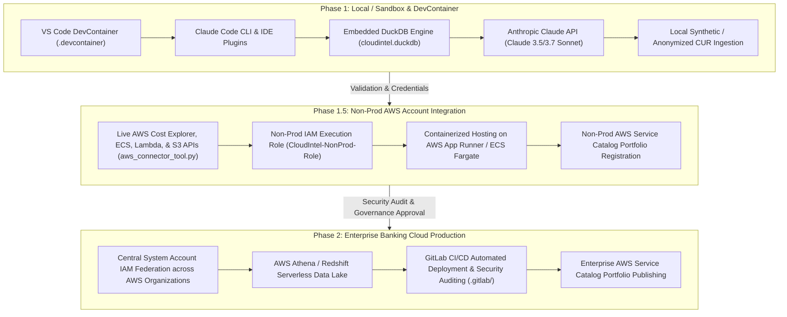

# Deployment Plan — CloudIntel: Enterprise AI FinOps Platform & Claude Code Plugin

---

## 1. Executive Summary & Vision

This document details the operational deployment plan for **CloudIntel**, an enterprise-grade AI FinOps intelligence platform natively powered by the **Anthropic Claude API** and architected as a **Claude Code Plugin & Anthropic Agent SDK ecosystem (`claude-code-plugins`)**.

It outlines the step-by-step procedures for deploying, configuring, hosting, operating, and promoting CloudIntel across environments:
- **Phase 1: Local / Sandbox DevContainer Deployment** (Claude Code CLI, DuckDB OLAP, Anthropic Messages API, synthetic/local data).
- **Phase 1.5: Non-Prod AWS Account & Service Catalog Integration** (Live Boto3 multi-account polling, non-prod IAM execution role, containerized hosting on AWS App Runner/ECS Fargate, and Non-Prod AWS Service Catalog portfolio).
- **Phase 2: Enterprise Cloud Production** (Central System Account IAM federation across enterprise AWS accounts, automated GitLab CI/CD deployment, AWS Athena/Redshift integration, and enterprise Service Catalog portfolio publishing).

---

## 2. Multi-Phase Deployment Strategy



---

## 3. Phase 1: Local DevContainer & Claude Code Plugin Setup

### Step 1: Open in VS Code DevContainer
The repository includes a ready-to-use development container specification (`.devcontainer/`):
1. Open the project folder in **Visual Studio Code**.
2. When prompted, click **"Reopen in Container"** (or run Command Palette: `Dev Containers: Reopen in Container`).
3. The container automatically provisions:
   - Python 3.11+
   - AWS CLI v2
   - DuckDB CLI & Python library
   - Claude Code CLI (`@anthropic-ai/claude-code`)
   - Sandbox permission handlers (`.devcontainer/scripts/setup-permissions.sh`)

### Step 2: Configure Environment Variables
Copy `.env.example` to `.env` and set your credentials:
```bash
cp .env.example .env
```

Edit `.env`:
```bash
# Core Environment
APP_ENV=local
LOG_LEVEL=INFO

# Anthropic Claude API Configuration
ANTHROPIC_API_KEY=sk-ant-api03-...
CLAUDE_PRIMARY_MODEL=claude-3-7-sonnet-20250219
CLAUDE_FAST_MODEL=claude-3-5-haiku-20241022

# AWS Credentials (for local / sandbox testing)
AWS_ACCESS_KEY_ID=AKIA...
AWS_SECRET_ACCESS_KEY=...
AWS_DEFAULT_REGION=us-east-1

# Database & Storage
DUCKDB_PATH=data/processed/cloudintel.duckdb
DATA_RAW_DIR=data/raw

# Banking Compliance Guardrails (ENFORCE | AUDIT)
GUARDRAILS_MODE=ENFORCE
ENFORCE_KMS_MANDATE=true
ENFORCE_ECS_SIDECARS=true
ENFORCE_LAMBDA_MEMORY_BOUNDS=true
ENFORCE_ZERO_PUBLIC_ACCESS=true
```

### Step 3: Run Data Ingestion & Plugin Verification
```bash
# Ingest raw CUR and multi-service telemetry into DuckDB
python plugins/finops-cost-optimizer/tools/data_ingest_tool.py

# Verify Claude Code CLI custom slash commands
claude /finops-query "Show me top 5 most expensive resources across BUs"
```

---

## 4. Phase 1.5: Non-Prod AWS Account Integration

### Step 1: Configure Non-Prod AWS Credentials / IAM Role
Authenticate your terminal or container environment to the target Non-Prod AWS Account:

```bash
# Option A: AWS SSO Login (Recommended)
aws sso login --profile nonprod-engineering

# Option B: IAM User Credentials / Session Token
export AWS_ACCESS_KEY_ID="ASIA..."
export AWS_SECRET_ACCESS_KEY="..."
export AWS_SESSION_TOKEN="..."
export AWS_DEFAULT_REGION="us-east-1"
```

Verify connection:
```bash
aws sts get-caller-identity
```

### Step 2: Test Live Non-Prod AWS Polling (`aws_connector_tool.py`)
```bash
python plugins/finops-cost-optimizer/tools/aws_connector_tool.py --account-id 040707863982
```
*Output Verification*:
- Queries AWS Cost Explorer (`ce:GetCostAndUsage`) for live unblended daily spend.
- Polls AWS CloudWatch & ECS APIs for container vCPU/RAM reservation vs. actual usage.
- Polls AWS Lambda APIs for memory allocations, duration, and concurrency.
- Polls AWS S3 APIs for bucket storage distribution and SSE-KMS encryption status.

### Step 3: Deploy Non-Prod CloudIntel Infrastructure via CloudFormation
Deploy the hosting stack (`aws_nonprod_deploy.yaml`) to run the Streamlit portal and Agent services in Non-Prod:

```bash
aws cloudformation deploy \
  --template-file aws_nonprod_deploy.yaml \
  --stack-name CloudIntel-NonProd-Stack \
  --parameter-overrides Environment=nonprod AnthropicApiKey=$ANTHROPIC_API_KEY \
  --capabilities CAPABILITY_NAMED_IAM \
  --region us-east-1
```

### Step 4: Register Remediation Products in AWS Service Catalog
Remediation CloudFormation templates generated by `/finops-remediate` can be directly registered into the Non-Prod **AWS Service Catalog Portfolio**:
```bash
aws servicecatalog create-product \
  --product-name "FinOps-ECS-Task-Resize-Prod" \
  --owner "FinOps-Platform-Team" \
  --product-type CLOUD_FORMATION_TEMPLATE \
  --provisioning-artifact-parameters file://service_catalog_product.json
```

---

## 5. Phase 2: Enterprise Cloud Production Deployment

### 5.1 Architecture & Federation Model
- **Central System Account Model**: CloudIntel executes under a centralized System Account IAM Role that assumes federated cross-account roles (`CloudIntel-CrossAccount-Role`) across all enterprise AWS accounts discovered via AWS Organizations.
- **Data Lake Query Engine**: Ingests multi-account Cost & Usage Reports (CUR 2.0 Parquet) stored in S3 directly into **AWS Athena / Redshift Serverless**.
- **Container Hosting**: Deployed on **Amazon ECS Fargate** across private subnets behind an Application Load Balancer (ALB) integrated with Enterprise SAML 2.0 / OIDC SSO.

### 5.2 GitLab CI/CD Automation Pipeline (`.gitlab/`)
The repository includes automated CI/CD pipeline definitions (`.gitlab/ci/`):

```yaml
# .gitlab-ci.yml Pipeline Stages
stages:
  - lint-and-test
  - guardrail-audit
  - iac-validate
  - deploy-nonprod
  - deploy-prod

lint-and-test:
  stage: lint-and-test
  script:
    - pytest tests/unit/
    - flake8 plugins/ tests/

guardrail-audit:
  stage: guardrail-audit
  script:
    - pytest tests/security/test_banking_compliance.py

iac-validate:
  stage: iac-validate
  script:
    - cfn-lint aws_nonprod_deploy.yaml
```

---

## 6. Environment Matrix & Requirements

| Requirement | Phase 1: Local / DevContainer | Phase 1.5: Non-Prod AWS Account | Phase 2: Enterprise Banking Production |
| :--- | :--- | :--- | :--- |
| **OS / Runtime** | Linux / macOS / Windows with DevContainer (Python 3.11+) | Amazon Linux 2 / ECS Fargate (Python 3.11+) | Hardened Enterprise Linux / ECS Fargate |
| **AI Model API** | Anthropic Claude API (`claude-3-7-sonnet-20250219`, `claude-3-5-sonnet-20241022`) | Anthropic Claude API with Prompt Caching | Anthropic Claude API (Enterprise Dedicated Endpoint) |
| **AWS Authentication** | Local AWS CLI / Access Keys via `.env` | Non-Prod IAM Role (`CloudIntel-NonProd-Role`) | Central System Account IAM Cross-Account Federation |
| **Account Discovery** | `accounts.json` registry file | `accounts.json` / Non-Prod Account List | AWS Organizations Auto-Discovery API |
| **Database** | Embedded DuckDB (`cloudintel.duckdb`) | Embedded DuckDB / S3 `httpfs` | AWS Athena / Amazon Redshift Serverless |
| **IaC Target** | Local YAML & `service_catalog_product.json` | Non-Prod AWS Service Catalog Portfolio | Enterprise AWS Service Catalog Portfolios & CI/CD |
| **Outbound Egress** | HTTPS Port 443 to `api.anthropic.com` | HTTPS Port 443 via NAT Gateway | HTTPS Port 443 via Enterprise Proxy / PrivateLink |

---

## 7. Health Check, Verification & Disaster Recovery

### 7.1 Automated Diagnostics & Health Checks

| Health Check Target | Execution Command | Success Criteria |
| :--- | :--- | :--- |
| **Claude API Connectivity** | `python tests/unit/test_claude_client.py` | Anthropic API returns `200 OK` with valid message stream |
| **DuckDB Database Health** | `python -c "import duckdb; conn=duckdb.connect('data/processed/cloudintel.duckdb'); print(conn.execute('SHOW TABLES').fetchall())"` | Lists all 5 core tables with >0 rows |
| **Guardrails Enforcement** | `pytest tests/security/test_banking_compliance.py` | 100% of unsafe candidate prompts intercepted with policy violation codes |
| **Agent SDK Evaluation** | `python agent-sdk-example/evaluation/evaluate_accuracy.py` | Accuracy >95%, zero guardrail bypasses |
| **Web Portal Health** | `curl -f http://localhost:8501/_stcore/health` | Returns HTTP `200 OK` |

### 7.2 Disaster Recovery & Rollback Procedures
1. **Corrupted Local DuckDB**:
   - Delete `data/processed/cloudintel.duckdb` and execute `python plugins/finops-cost-optimizer/tools/data_ingest_tool.py` to rebuild from source raw data.
2. **Claude API Latency / Rate Limits**:
   - `claude_client.py` implements exponential backoff retry. For high-volume triage, the platform automatically falls back to `claude-3-5-haiku-20241022`.
3. **Container Rollback**:
   - Revert AWS App Runner or ECS Task Definition to previous immutable ECR image tag via AWS Management Console or AWS CLI.

---

*CloudIntel Deployment Plan — Powered by Anthropic Claude API & Claude Code Plugins.*
